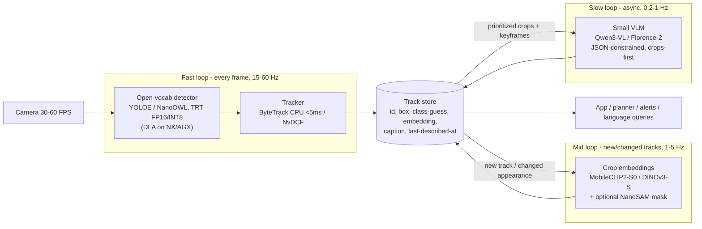
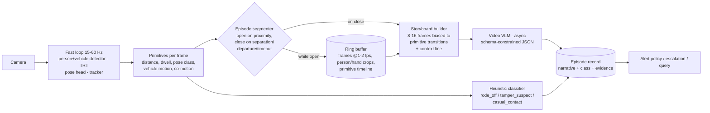

# Generic visual perception on Jetson Orin: fast open-vocabulary vision, slow language

**Date:** 2026-08-07 · **Status:** research report (no code, no hardware runs)
**Question:** On a Jetson Orin with limited memory bandwidth, can we understand scenes and objects *generically* — beyond fixed training categories — with fast detection and reasonable accuracy, accepting that LLM-grade description is slow?
**Method:** four parallel web-research agents (open-vocab detectors / segmentation+embeddings / VLMs-on-Orin / architecture+hardware), synthesized here. Every number carries a source and a tag: **[measured]** = benchmarked by the cited source · **[claimed]** = vendor/paper claim, not independently verified · **[3p]** = independent third party · **[est.]** = our arithmetic/inference, no benchmark exists. Nothing in this report was run on hardware by us.
**Scope update (2026-08-07, later same day):** the use case narrowed to *describing ~20-second person–vehicle interaction events* ("person tampered with a parked motorcycle" vs "mounted it and rode off"). Part I (§1–§10) stands as the general survey; **Part II (§11–§16)** applies it to event description, with a fifth research pass on video/temporal models.
**Roster note:** domain owners for follow-up are `vision-engineer` (fast loop, TensorRT, trackers), `video-analytics-engineer` (foundation-model selection, auto-labeling), `gpu-engineer` (TensorRT/DLA depth). Related prior note: [encoder-free multimodal LLMs](encoder-free-multimodal-2026-06.md) (TTFT/encoder economics — the same tradeoff FastVLM exploits, §5).

---

## TL;DR

**Yes, it's possible — and the split you're already planning (fast vision, slow description) is not a workaround; it's the architecturally correct design.** Three findings carry the argument:

1. **The bandwidth constraint punishes language, not vision.** An LLM reads *all* of its weights per generated token (arithmetic intensity ≈ 1 → bandwidth-bound): a 3B model in INT4 decodes at a hard ceiling of `bandwidth ÷ ~1.9 GB`, and measured stacks hit 70–90% of that ceiling — ~43 tok/s on Orin Nano Super, ~80 tok/s on AGX Orin [measured, §1]. A detector's weights are 25–200 *MB* reused across the whole image (compute-bound): the same silicon runs open-vocabulary detection at 25–95 FPS [measured, §3]. Physics assigns the roles; your instinct is right.

2. **Open-vocabulary stopped meaning slow in 2024–2025.** The trick is *prompt-then-detect*: text prompts are embedded **once, offline**, cached (or literally folded into the detector's weights), so runtime cost equals a closed-set YOLO. Deployable today: **YOLOE** (ICCV 2025 — text / visual-exemplar / prompt-free modes, ~28–36 zero-shot LVIS AP, TensorRT-exportable, AGPL) and NVIDIA's **NanoOWL** (Apache-2.0, **95 FPS measured on AGX Orin**). A third-party study (Frontiers, Oct 2025) benchmarked exactly this question on AGX Orin and lands where we do: NanoOWL + EfficientViT-SAM is the current real-time open-vocab pipeline [3p, §4].

3. **The field already ships this two-tier shape.** Figure Helix runs a 7B VLM at 7–9 Hz beside a 200 Hz fast loop [claimed]; NVIDIA GR00T N1 runs 10 Hz / 120 Hz [claimed, measured on an L40, not Jetson]; and 2025–26 systems run it *onboard Orin*: FindAnything does open-vocab mapping fully onboard an Orin NX 16GB drone with ~3 Hz semantics [measured, §6]. NVIDIA's own Jetson Platform Services packages the same split (NanoOWL zero-shot detection service + VLM alert service).

**Default recipe** (details and alternatives in §8):

| Tier | Orin Nano 8GB (Super) | Orin NX 16GB | AGX Orin 64GB |
|---|---|---|---|
| Fast loop (every frame) | YOLOE-S reparam → TRT FP16/INT8, ~25–60 FPS [est. from closed-set ceiling 139–219 FPS] + ByteTrack (CPU, <5 ms) | same, M-size; park detector on DLA INT8 | YOLOE-L or NanoOWL B/16 (25 FPS [measured]) + EfficientViT-SAM-L0 masks (8 ms [measured]) |
| Mid loop (new/changed tracks, 1–5 Hz) | MobileCLIP2-S0 crop embeddings (~ms-scale) | + DINOv3 ViT-S dense features | + DINOv3 ViT-B / C-RADIOv4 |
| Slow loop (0.2–1 Hz) | Qwen3-VL-2B INT4 (Apache) or SmolVLM2-500M; short JSON outputs | Qwen3-VL-4B; Florence-2-base for grounding [no Jetson bench exists — benchmark yourself, §5] | Qwen3-VL-8B (~2 Hz short outputs) or Cosmos-Reason2-2B |
| Expected zero-shot quality | LVIS-minival ~26–28 AP class | ~31–33 AP | ~36 AP (+ masks) |

Accuracy honesty: zero-shot LVIS AP 26–36 means "recognizes most everyday things most of the time, misses rare/small/weird-viewpoint objects" — good enough to be useful, not magic. The ratchet that closes the gap per deployment is §9 (visual prompts + auto-label-and-distill).

---

## 1. Why the split is physics, not preference

Two existence proofs first. Human "core object recognition" — knowing *what* you're looking at — completes in ~100–200 ms of largely feedforward processing (category-selective ERP divergence at ~150 ms: Thorpe et al., *Nature* 1996; the "core recognition" framing: DiCarlo, Zoccolan & Rust, *Neuron* 2012). Deliberate scene *description* is much slower and sits outside the reactive loop — Kahneman's System 1 / System 2 is the pop handle. Production AV stacks make the same split in silicon: specialized detectors/trackers at fixed 10–30 Hz budgets in the car; foundation models appear *offline*, as auto-labelers and distillation teachers.

On Orin the argument becomes arithmetic. At batch size 1:

- **LLM decode is bandwidth-bound.** Every generated token reads every weight once, with almost no reuse. Ceiling: `tok/s ≤ bandwidth ÷ weight-bytes`. Measured numbers sit at **69–88% of that ceiling** across SKUs and runtimes [measured, table below] — so the ceiling is the design tool: `tok/s ≈ 0.75 × BW ÷ bytes`.
- **Vision inference is compute-bound.** YOLOE-S is 12M params ≈ 24 MB FP16 — at 30 FPS that's 0.7 GB/s of weight traffic against 102 GB/s, and convolutions reuse every byte many times. Even NanoOWL's ViT-B/32 (~175 MB) at its measured 95 FPS implies ~17 GB/s — well inside AGX's 204.8 GB/s. Vision spends the *compute* budget (TOPS), which Orin has in relative abundance.
- **VLM prefill (vision-encode + prompt ingest) is compute-bound; decode is bandwidth-bound.** Prefill on Orin NX runs ~512 tok/s while decode runs ~18 tok/s on the same model [measured, llama.cpp]. Translation: *time-to-first-description* is set by the vision encoder and prompt length; *words per second* is set by bandwidth. Short outputs are the lever you control.

Roofline check against real measurements (all INT4/Q4 unless noted; sources §5):

| Case | Weights | Measured | Implied BW | % of spec |
|---|---|---|---|---|
| Llama-3.2-3B, Nano (orig, 68 GB/s), MLC | ~1.9 GB | 27.7 tok/s [measured] | 52.6 GB/s | 77% |
| Llama-3.2-3B, Nano Super (102 GB/s), MLC | ~1.9 GB | 43.1 tok/s [measured] | 81.9 GB/s | 80% |
| Llama-3.1-8B, Nano Super | ~4.5 GB | 19.1 tok/s [measured] | 86 GB/s | 84% |
| Llama-3.2-3B, AGX Orin (204.8 GB/s), MLC | ~1.9 GB | 80.4 tok/s [measured] | 153 GB/s | 75% |
| Llama-7B F16, Orin NX (102.4 GB/s), llama.cpp | ~12.6 GB | 7.2 tok/s [measured] | 90 GB/s | 88% |

Sources: [Jetson AI Lab benchmarks](https://github.com/dusty-nv/jetson-ai-lab/blob/main/docs/benchmarks.md), [NVIDIA Orin Nano Super blog](https://developer.nvidia.com/blog/nvidia-jetson-orin-nano-developer-kit-gets-a-super-boost/), [llama.cpp discussion #5059](https://github.com/ggml-org/llama.cpp/discussions/5059), [SLM tutorial](https://github.com/dusty-nv/jetson-ai-lab/blob/main/docs/tutorial_slm.md). Corollaries: INT4 quantization is not optional — it's the bandwidth knob; and nothing you do to the GPU makes decode faster than the ceiling — pick model size by the words/sec you need.

**Design consequence:** put per-frame semantics in models measured in *megabytes*, per-second/on-demand semantics in models measured in *gigabytes*, and let a tracker carry identity between slow-loop updates so nothing is lost by the rate gap.

## 2. "Generic understanding" is four different contracts — pick per subsystem

| Contract | You provide | You get | Tools (best-in-class today) | Rate on Orin |
|---|---|---|---|---|
| **Open-vocab detection** — *name it, then find it* | free-text prompt list (changeable at runtime) | boxes+scores for those names, zero-shot | YOLOE, YOLO-World, NanoOWL, DOSOD | 25–95 FPS |
| **Class-agnostic propose + match** — *find everything, name later* | nothing (or exemplar crops) | all salient objects as boxes/masks + embeddings → match, retrieve, cluster, flag-novel | NanoSAM / EfficientViT-SAM + MobileCLIP2; YOLOE prompt-free; YOLO-UniOW wildcard | 15–120 FPS |
| **Dense features** — *pixels → semantics without labels* | nothing | per-patch features for correspondence, discovery, few-shot, anomaly | DINOv3 (ViT-S/B, ConvNeXt-T), C-RADIOv4 | per-keyframe |
| **Rich description / VQA** — *tell me about it* | keyframe or crop + prompt | captions, attributes, relations, grounded answers | Qwen3-VL small, Florence-2, Cosmos-Reason2 | 0.2–2 Hz |

The first two are the fast loop, the last is the slow loop, dense features straddle. The glue is a **tracker**: semantics attach to *track IDs*, not frames, so a caption computed at t=0 stays attached to the object at t=5 s. That single decision — semantics bind to tracks — is what makes a 0.5 Hz VLM feel like continuous understanding.

## 3. Lane 1 — real-time open-vocabulary detection (the workhorse)

**How these stay fast:** the text encoder runs **once per vocabulary change, never per frame**. YOLO-World's "reparameterization" folds prompt embeddings into conv weights — the deployed artifact *is* a standard YOLO with your vocabulary baked in ([YOLO-World, CVPR 2024](https://arxiv.org/abs/2401.17270)). YOLOE's RepRTA does the same with zero inference overhead vs the base YOLO, and adds visual-exemplar prompts (SAVPE) and a prompt-free mode over a built-in ~4.6K-class vocabulary ([YOLOE, ICCV 2025](https://arxiv.org/abs/2503.07465)). NanoOWL caches OWL-ViT text embeddings at startup ([repo](https://github.com/NVIDIA-AI-IOT/nanoowl)). Runtime cost is therefore independent of vocabulary size; re-prompting = swapping a tensor (or, for baked YOLO exports, re-exporting the engine).

**Menu (zero-shot LVIS-minival AP; deployable-on-your-hardware models first):**

| Model | Params | LVIS AP | Speed | Prompting | License |
|---|---|---|---|---|---|
| **YOLOE-v8-S / M / L** | 12/27/45M | **27.9 / 32.6 / 35.9** (text) [measured] | 306/157/103 FPS T4-TRT [measured]; **no public Jetson bench** [est.: ≈ closed-set YOLO after reparam] | text (cached) + visual + prompt-free | AGPL-3.0 |
| YOLOE-26-S / L (2026) | 13/32M | 29.9 / 36.8 [claimed] | 161 FPS T4 (L) [claimed] | same | AGPL-3.0 |
| YOLO-Worldv2-S / L | 13/47M | 22.7 / 33.0 [measured] | 1221/553 FPS RTX4090-TRT [3p] | text (baked at export) | GPL-3.0 |
| DOSOD-S / L | 11/44M | 26.7 / 34.4 [measured] | 1582/632 FPS 4090; 31–47 FPS on a 10-TOPS RDK X5 INT8 [measured] | text (cached, decoupled) | GPL-3.0 |
| YOLO-UniOW-S/M/L | 7.5–29M | 26.2–34.6 [measured] | 98–65 FPS V100 [measured] | cached text + **wildcard "unknown" flagging** | GPL-3.0 |
| **NanoOWL** (OWL-ViT B/32 / B/16) | ~87M | "mAP 28 / 31.7" (README metric) | **95 / 25 FPS on AGX Orin, TRT FP16 [measured — bare engine; end-to-end camera pipelines report well below this** ([forum](https://forums.developer.nvidia.com/t/nanoowl-tutorial-on-jetson-ai-lab-has-significantly-lower-frame-rate-than-shared-on-github/311248))] | text, cached at startup; tree prediction (`[a face (happy, sad)]`) | **Apache-2.0** |
| OWLv2-L/14 (accuracy anchor) | ~430M | APr 44.6 (LVIS val, rare) [measured] | ~1–5 FPS unoptimized GPU | cacheable | Apache-2.0 |
| OmDet-Turbo | ~100M | COCO-zs 53.4 AP | 100 FPS TRT desktop [claimed]; no Jetson data | decoupled, cacheable | Apache-2.0 |
| mm-Grounding-DINO-T (teacher) | 172M | **41.4** [measured] | 1–6 FPS GPU — not edge | per-frame fusion | Apache-2.0 |
| *DINO-X Edge* | n/a | **48.3** [claimed] | **20.1 FPS Orin NX TRT-FP16** [claimed] | text/visual | **API-only — no weights, cannot self-deploy** |
| *Grounding DINO 1.5 / 1.6 Edge* | n/a | 36.2 / 34.6 [claimed] | >10 / ~15 FPS Orin NX TRT [claimed] | — | API-only |

Closed-set speed ceiling for calibration (what "specialized" buys): YOLO26n/s TensorRT FP16 @640 — AGX Orin 382/266 FPS, Orin NX 242/156, Orin Nano Super 219/139 [measured, [Ultralytics Jetson guide](https://docs.ultralytics.com/guides/nvidia-jetson)]; YOLO11s INT8 145.8 FPS @15 W on Nano Super [measured, Ultralytics]. An open-vocab YOLO with baked vocabulary should land within ~0.6–1.0× of these [est.].

**Negative findings, stated plainly (Rule 6):** no credible Jetson-measured FPS exists for YOLO-World, YOLOE, OmDet-Turbo, or OVLW-DETR — the table's Jetson expectations for those are inference from the reparameterization argument plus the closed-set ceiling, and the first prototype task is to measure them (§8). The best *claimed* accuracy-at-Orin-speed point (DINO-X Edge) is not obtainable as weights; the strongest open models at that accuracy (mm-GDINO, LLMDet 44.7–51.1 AP) are teachers, not edge runners.

**License landmine:** the entire fast YOLO open-vocab lineage is GPL/AGPL (YOLO-World GPL-3.0; YOLOE AGPL-3.0 via Ultralytics; DOSOD, YOLO-UniOW GPL-3.0). For a shipped product that's a copyleft decision or an Ultralytics commercial license. Permissive real-time options: **NanoOWL (Apache)**, OmDet-Turbo (Apache), OWLv2 (Apache, needs your own TRT work).

## 4. Lane 2 — segment/propose everything, then match embeddings

This lane needs no names at all: generate masks/proposals class-agnostically, attach an embedding to each, then match against text prompts, exemplar images, or past observations. It's the lane that handles "I can't name it but I need to track it," retrieval ("find the thing that looked like this"), and novelty ("flag anything unfamiliar").

**Segmenters with real Orin numbers:**

| Model | Quality | Orin latency | License |
|---|---|---|---|
| **NanoSAM** (NVIDIA) | mIoU 0.706 (COCO GT-box; SAM-H ≈ 0.76, MobileSAM 0.728) | **8.1 ms AGX / 27 ms Orin Nano, TRT FP16** [measured] | Apache-2.0 |
| **EfficientViT-SAM-L0 → XL1** (MIT Han Lab) | COCO box-prompt mAP **45.7 → 47.8** — XL ≥ original SAM-H (46.5) | **8.2 → 37.2 ms on AGX Orin, TRT FP16, end-to-end** [measured] | Apache-2.0 |
| MobileSAM | mIoU 0.728 | 39 ms AGX [measured, NVIDIA] — encoder must run FP32 in TRT (FP16 breaks it) | Apache-2.0 |
| FastSAM (everything-mode) | coarse masks (point-mIoU 30.7 [3p]) | 40 ms RTX3090 [measured]; proposal generator, not a quality masker | Apache-2.0 |
| SAM 2.1-tiny (video, streaming memory) | SA-V J&F 76.5 | 91 FPS on A100 [measured]; **no official Jetson numbers**; TRT-on-Orin has open accuracy issues ([forum](https://forums.developer.nvidia.com/t/sam2-tensorrt-engine-produces-different-results-from-pytorch-on-jetson-orin-nano-jetpack-6-1/361166)) | Apache-2.0 |
| **EdgeTAM** (Meta, CVPR 2025) | ≈ SAM2-small quality (SA-V 71.7) | **16 FPS on iPhone 15 Pro Max, 22× faster than SAM2 on-device** [measured]; **no Jetson port exists — a gap worth filling in-house** | Apache-2.0 |
| SAM 3 (Meta, Nov 2025) | concept prompts: text → detect+segment+**track all instances**; SOTA | 848M params, ~30 ms on an **H200** [claimed] — **not an edge model; use server-side as teacher/auto-labeler** | SAM License (commercial OK, conditions) |

**Embedding side** (classify/match the crops or masks): **MobileCLIP2-S0** — 71.5% zero-shot ImageNet at 1.5 ms image-encode on an iPhone 12 [measured, Apple; ≈ SigLIP-B accuracy at ~1/8 latency] — makes 10–30 crops/frame feasible; S2/B step up to 77.2/79.4% (code MIT, **weights under Apple's ML Research TOU — check before shipping**). **SigLIP 2-B/16** is the Apache-2.0 alternative (79.1% [claimed], no edge latency published). Caveat from the literature: naive tight-crop→CLIP degrades badly on small objects — use context-padded box crops or mask-pooled patch features; [Open-Vocabulary SAM (ECCV 2024)](https://arxiv.org/abs/2401.02955) quantifies the failure and the fix.

**Dense features** (the "understand without categories" substrate): **DINOv3** (Meta, Aug 2025 — gram-anchored 7B teacher distilled into ViT-S/16 21M, S+ 29M, B 86M and ConvNeXt-T/S/B/L explicitly for constrained deployment; commercial-permitting custom license) gives training-free open-set retrieval, few-shot recognition (kNN), unsupervised discovery, correspondence, and 1-shot anomaly detection (AnomalyDINO: MVTec-AD AUROC 96.6 [claimed]). **C-RADIOv4** (NVIDIA, Jan 2026) distills SigLIP2-g + DINOv3-7B + SAM3 into *one* backbone under the NVIDIA Open Model License — one encoder yielding CLIP-space matching + DINO-grade dense features + SAM-compatible features is the strongest "single backbone for the whole fast loop" candidate, though no Jetson latency is published yet [negative finding]. Edge caution [3p]: small-ViT FP16 TRT on Orin sometimes shows *no* speedup over FP32 ([TensorRT #4348](https://github.com/NVIDIA/TensorRT/issues/4348)) — benchmark INT8/best per model, don't assume.

**Third-party validation of the whole lane:** *Real-time open-vocabulary perception for mobile robots on edge devices* (Frontiers in Robotics & AI, Oct 2025) swept {NanoOWL, YOLO-World} × {NanoSAM, EfficientViT-SAM} on AGX Orin 64GB under TensorRT and concluded **NanoOWL + EfficientViT-SAM is the top real-time (>15 FPS) open-vocab instance-segmentation pipeline** [3p, [paper](https://www.frontiersin.org/journals/robotics-and-ai/articles/10.3389/frobt.2025.1693988/full)].

## 5. Lane 3 — the slow semantic loop (VLMs on Orin)

**Measured throughput, NVIDIA's own numbers** (INT4 MLC; Orin Nano 8GB original → Super mode) [claimed, NVIDIA-measured; [source](https://github.com/dusty-nv/jetson-ai-lab/blob/main/docs/benchmarks.md)]:

| LLM | orig → Super (tok/s) | | VLM | orig → Super |
|---|---|---|---|---|
| Llama 3.2 3B | 27.7 → **43.1** | | PaliGemma2 3B | 13.7 → **21.6** |
| Llama 3.1 8B | 14 → 19.1 | | SmolVLM 2B | 8.1 → 12.9 |
| Qwen2.5 7B | 14.2 → 21.8 | | InternVL2.5 4B | 2.5 → 5.1 |
| Gemma 2 2B | 21.5 → 35.0 | | VILA 1.5 3B | 0.7 → 1.06 |

Caveat [est.]: the VLM column mixes pipeline stages and runtime maturity (a 2B that decodes ~35 tok/s cannot "run at 12.9" unless encode+prefill is included) — treat the 1.4–2× Super-mode gains as the robust signal and benchmark your candidate yourself. AGX Orin reference points: Llama-3.2-3B **80.4 tok/s**; NVILA-8B via AWQ/TinyChat **28.1 tok/s decode, TTFT 0.275 s** [claimed, NVIDIA]; Cosmos-Reason2-2B on Orin Nano Super: **38–60 tok/s, image TTFT 75–420 ms** depending on runtime [3p, measured].

**Model picks by constraint:**

- **Qwen3-VL-2B/4B/8B (Oct 2025, Apache-2.0, official GGUFs)** — the new default small grounded VLM; emits stable JSON boxes/points; fixes Qwen2.5-VL-3B's **non-commercial research license** (a real trap — check the LICENSE file, not blog summaries).
- **Florence-2 base/large (0.23/0.77B, MIT)** — a *mid-tier* semantic engine, not a chat model: captions, **dense region captions**, phrase grounding, referring segmentation, OCR, one prompt-switched model. **No credible Jetson benchmark exists** [negative finding — the one paper claiming 45 ms/inference on Orin Nano is not credible for an autoregressive pipeline]; scaling its ~1 s/image T4 figure by compute puts it at **~1.5–4 s/image on Nano Super, ~0.5–1.5 s on AGX [est.]** — still comfortably a 0.3–1 Hz grounding/captioning tier. ONNX ports exist; no maintained TensorRT path (encoder-decoder shape doesn't fit TRT-LLM).
- **Cosmos-Reason2-2B (NVIDIA, Jan 2026, NVIDIA Open Model License)** — physical-AI VLM with points/boxes/trajectories, already third-party-benchmarked on Orin Nano Super (above).
- **SmolVLM2 256M/500M/2.2B (Apache)** — the floor of the range; 2.2B runs in 5.2 GB, 256M in 1.38 GB [claimed].
- **Moondream 2 (1.9B, Apache) / Moondream 3 preview (9B-MoE, 2B active, BSL-1.1)** — 3 is decode-cheap for its ceiling but ~8 GB at 4-bit → NX-16/AGX territory.
- Traps: **VILA/NVILA weights are CC-BY-NC** (the best-documented Jetson VLM family is non-commercial); Gemma 3 4B is marginal under load on 8 GB [3p]; **FastVLM** (Apple, CVPR 2025 — 85× TTFT claim) is an architecture lesson (hybrid conv-ViT encoders slash prefill — same economics as the [encoder-free note](encoder-free-multimodal-2026-06.md)), not a deployable Jetson stack.

**Runtime verdict [est. from the evidence]:** default to **llama.cpp/Ollama** — best model coverage (day-one GGUFs), official CUDA/Jetson support, **JSON-schema/grammar-constrained decoding** (fixes small-VLM JSON flakiness at zero retries), `cache_prompt` reuse of the fixed system prompt. Step up to **MLC** (fastest decode; powers NVIDIA's tables) or **AWQ/TinyChat** (W4A16 LLM + W8A8 vision tower) when you need the last ~30%. **TensorRT-LLM on Orin is a frozen v0.12 preview, AGX-only** — not the pragmatic path (it is on Thor). Quantize the LLM to INT4; keep the vision tower FP16/W8A8 — nobody ships INT4 ViT towers, and grounding degrades if you try [3p consensus].

**Serving pattern for 0.2–2 Hz:** drive the slow loop from fast-loop *events* (new track, scene change), not a timer; send **crops, not whole frames**, for small objects (VLM input resize destroys detail — Florence-2 region tasks and Qwen grounded outputs are region-native); keep outputs short (token count dominates: 40 output tokens ÷ 40 tok/s = 1 s before you've encoded anything); keep the model resident (Ollama keep-alive). NVIDIA's Jetson Platform Services ships this exact loop as the VLM alert microservice; Live-Llava (NanoLLM VideoQuery) is the open tutorial version.

## 6. Reference architecture

Rules that make it work:

1. **Semantics bind to tracks, not frames.** The tracker (ByteTrack: Kalman+IoU, <5 ms on CPU, no model [3p]) is what converts a 0.5 Hz VLM into continuous-feeling understanding. New track → embed (mid loop) → describe (slow loop); re-describe only on appearance/scale change. This is precisely the pattern the open-vocab mapping literature converged on — CLIP/VLM features anchored to persistent geometry at 0.2–3 Hz: ConceptFusion → ConceptGraphs → Clio (onboard-laptop, task-driven) → **FindAnything (fully onboard Orin NX 16GB MAV, ~3 Hz semantic updates, 2025)** and OVO's async best-view queues. None of the 2023 systems ran onboard; the 2025–26 ones do — on your exact hardware class.
2. **Vocabulary is a cache** (§3). Re-prompting NanoOWL/YOLOE-text is a tensor swap; a baked YOLO-World export needs a re-export — decide whether runtime re-prompting matters before choosing.
3. **The slow loop is preemptible; the fast loop owns the deadline.** Dropped keyframes are fine. Run the VLM at idle priority.
4. **Budget bandwidth, not TOPS.** CPU, GPU and accelerators share one LPDDR pool; a decoding LLM eats the bandwidth vision needs — the 2026 embedded-foundation-model survey names unified-memory contention *the* bottleneck [3p]. Mitigations, in order: shorter outputs, INT4, park the detector on **DLA** (NX/AGX only — CNNs, INT8; frees the GPU for the VLM at a known ~2–4× per-layer latency cost), move trackers/flow to **PVA/OFA via VPI**, cap slow-loop rate. There is *no* official co-scheduling guidance [negative finding] — measure your fast-loop FPS *while the VLM decodes*, not in isolation.
5. **Precedent rates** to sanity-check yours: Helix S2 7–9 Hz / S1 200 Hz onboard [claimed]; GR00T N1 10 / 120 Hz [claimed — measured on a datacenter L40, not Jetson]; "Looking Fast and Slow" (Google 2019) is the original keyframe+memory scheduling paper and its asynchronous variant is the fix for keyframe latency spikes.

## 7. Hardware ground truth & deployment playbook

| Module | INT8 TOPS (sparse→Super) | GPU | DLA | Bandwidth (→Super) | Power |
|---|---|---|---|---|---|
| Orin Nano 8GB | 40 → 67 | 1024 CUDA / 32 TC | **none** | **68 → 102 GB/s** | 7–15 → 25 W |
| Orin NX 16GB | 100 → 157 | 1024 / 32 | 2× NVDLA v2 | 102.4 (unchanged) | 10–25 → 40 W |
| AGX Orin 64GB | 275 | 2048 / 64 | 2× NVDLA v2 | 204.8 GB/s | 15–60 W |

[measured/claimed — NVIDIA datasheets & [JetPack 6.2 Super-mode blog](https://developer.nvidia.com/blog/nvidia-jetpack-6-2-brings-super-mode-to-nvidia-jetson-orin-nano-and-jetson-orin-nx-modules/); headline TOPS assume 2:4 sparsity — dense is half, and one forum microbenchmark failed to reach claimed sparse throughput [3p].]

- **JetPack 6.2 (Jan 2025) "Super" modes are free performance** for Nano/NX (Nano: +50% bandwidth — directly raising your VLM ceiling) — but MAXN/MAXN-SUPER are *unconstrained* modes: sustained ≠ burst. Active cooling is mandatory; a 3-stream DeepStream pipeline throttled at 68–70 °C in the field [3p]. Validate **sustained** FPS with `nvpmodel` + `jetson_clocks`.
- **Precision ladder:** FP16 ≈ 2–3× over FP32 at <1% mAP loss (safe default); INT8 ≈ +1.6× further with PTQ over 500–1000 domain-matched calibration images [3p]; QAT only if PTQ hurts. INT8 can be no faster than FP16 at batch 1 on some models — measure.
- **Pipelines:** DeepStream for multi-stream video analytics (zero-copy NVMM camera→GPU; 18× 1080p30 YOLOv8s INT8 streams on Orin NX 16GB [measured, Seeed]); **Isaac ROS** for robots (NITROS zero-copy; `isaac_ros_rtdetr`/SyntheticaDETR at 150–450 FPS across Orin SKUs [measured, NVIDIA]); **Jetson Platform Services** if you want the NanoOWL zero-shot detector and VLM alert loop as prebuilt REST microservices.
- **Upgrade path:** Jetson AGX Thor (GA Aug 2025, $3,499 dev kit): 2070 FP4 TFLOPS, 128 GB @ **273 GB/s**. Note the asymmetry: ~7.5× compute but only 1.33× bandwidth over AGX Orin — Thor transforms the *vision/prefill* budget far more than decode tok/s [claimed]. Early TensorRT had silent FP4→FP32 fallbacks [3p]; treat first-gen numbers skeptically.

## 8. What I'd prototype first (two weeks, falsifiable)

**Week 1 — fast loop + the missing benchmark.** (a) Ultralytics YOLOE-11-S/M: set your vocabulary, `save_prompt_embeddings`, export TensorRT FP16 → measure **sustained** FPS on your SKU inside the real camera pipeline — this fills the genuine gap in the public record (no Jetson YOLOE numbers exist) and takes ~a day. (b) Add ByteTrack (CPU). (c) Try YOLOE prompt-free mode for find-everything; note recall on things you *can't* name. (d) If licensing matters, run the same day with NanoOWL (Apache) and compare accuracy/FPS on your scenes. Gate: ≥15 FPS sustained with tracking on target power mode.

**Week 2 — slow loop + contention.** (a) Ollama + Qwen3-VL (2B on Nano / 4B–8B on NX/AGX), JSON-schema-constrained, event-driven crops from the tracker. Measure TTFT and tok/s **while the detector runs** — the contention number no benchmark will give you. (b) Florence-2-base via ONNXRuntime as the grounding/dense-caption alternative; time it (you'll be generating the first public Jetson numbers). (c) Wire captions/embeddings into the track store; demo a language query over 10 minutes of scene memory. Gate: <2 s from "new object appears" to first description, fast loop still ≥ its Week-1 FPS.

Metrics that decide everything: sustained FPS @ power mode; camera→track latency; VLM TTFT + tok/s under concurrent vision load; zero-shot hit-rate on your top-20 objects; novel-object recall in prompt-free mode.

## 9. Accuracy reality check — and the ratchet

Zero-shot LVIS-minival 26–36 AP (the deployable range) is "recognizes most common things, reliably misses rare/small/odd-viewpoint ones." Non-negotiable context: a *specialized* detector fine-tuned on your 20 recurring categories will beat every model in §3 on those categories at half the compute. The mature pattern is therefore **both**:

1. **Open-vocab for the long tail + runtime flexibility** (the §3/§4 stack).
2. **Distill the head of your distribution**: run big teachers *offline* on your logged footage — SAM 3 (concept-prompted detect+segment+track), LLMDet/mm-GDINO (41–51 AP), DINO-X API — auto-label, then fine-tune the small fast model per deployment (the Autodistill pattern; also YOLOE's visual-prompt SAVPE and DINOv3-kNN prototypes for few-shot without retraining). This is exactly the AV-industry shape from §1: foundation models as teachers, specialized students in the loop. In roster terms: batch auto-labeling is `video-analytics-engineer`'s charter; the resulting engines land back with `vision-engineer`.
3. For "flag the unknown unknowns," YOLO-UniOW's wildcard embedding and DINOv3-feature novelty scoring are the current tools.

## 10. Open questions (answers would narrow the next iteration)

> **Update:** question 2/4/5 were answered same-day — the target is 20-second event description (see Part II). Remaining questions consolidated in §16.

1. **Which Orin SKU and power mode?** Bandwidth 68→205 GB/s moves only the VLM tier; DLA presence (NX/AGX) changes the contention strategy.
2. What rate does the *consumer* of detections need — control loop (≥15 Hz), alerting (~1 Hz), or logging/query (async)?
3. Camera static or moving? Indoor/outdoor? Object size distribution (small objects force resolution↑ → FPS↓ — the dominant tradeoff)?
4. Is naming-in-advance acceptable (prompt list), or is find-anything-unnamed required (lane 2)?
5. Latency tolerance for first description of a new object?
6. Is per-deployment specialization allowed (auto-label + fine-tune), or must everything stay zero-shot?
7. Licensing constraints — AGPL acceptable? (Decides YOLOE vs NanoOWL as the fast-loop default.)

---

## Sources

**Foundations / books.** Thorpe, Fize & Marlot, *Speed of processing in the human visual system*, Nature 381 (1996). DiCarlo, Zoccolan & Rust, *How does the brain solve visual object recognition?*, Neuron 73 (2012). Kahneman, *Thinking, Fast and Slow* (2011). Szeliski, *Computer Vision: Algorithms and Applications*, 2nd ed. (2022, free at szeliski.org) — background reference.

**Open-vocab detection.** [YOLO-World (CVPR 2024)](https://arxiv.org/abs/2401.17270) · [repo](https://github.com/AILab-CVC/YOLO-World) · [Ultralytics YOLO-World docs](https://docs.ultralytics.com/models/yolo-world) · [YOLOE (ICCV 2025)](https://arxiv.org/abs/2503.07465) · [repo](https://github.com/THU-MIG/yoloe) · [Ultralytics YOLOE docs (incl. YOLOE-26)](https://docs.ultralytics.com/models/yoloe) · [YOLO-UniOW](https://github.com/THU-MIG/YOLO-UniOW) · [DOSOD](https://arxiv.org/abs/2412.14680) · [Grounding DINO 1.5](https://arxiv.org/abs/2405.10300) · [DINO-X (Edge: 48.3 AP / 20.1 FPS Orin NX)](https://arxiv.org/abs/2411.14347) · [API-only status](https://github.com/IDEA-Research/Grounding-DINO-1.5-API) · [NanoOWL](https://github.com/NVIDIA-AI-IOT/nanoowl) · [NanoOWL real-world FPS thread](https://forums.developer.nvidia.com/t/nanoowl-tutorial-on-jetson-ai-lab-has-significantly-lower-frame-rate-than-shared-on-github/311248) · [OWLv2 (NeurIPS 2023)](https://arxiv.org/abs/2306.09683) · [mm-Grounding-DINO](https://huggingface.co/openmmlab-community/mm_grounding_dino_tiny_o365v1_goldg_grit_v3det) · [LLMDet (CVPR 2025)](https://arxiv.org/abs/2501.18954) · [OmDet-Turbo](https://arxiv.org/abs/2403.06892) · [OV-DEIM (2026)](https://arxiv.org/abs/2603.07022) · [Ultralytics Jetson benchmarks (YOLO26/YOLO11 TRT tables)](https://docs.ultralytics.com/guides/nvidia-jetson) · [Seeed YOLOv8 Jetson benchmarks](https://www.seeedstudio.com/blog/2023/03/30/yolov8-performance-benchmarks-on-nvidia-jetson-devices/)

**Segmentation & features.** [NanoSAM (Orin latency table)](https://github.com/NVIDIA-AI-IOT/nanosam) · [EfficientViT-SAM (AGX Orin table)](https://github.com/mit-han-lab/efficientvit/blob/master/applications/efficientvit_sam/README.md) · [MobileSAM](https://arxiv.org/abs/2306.14289) · [FastSAM](https://arxiv.org/abs/2306.12156) · [SlimSAM](https://arxiv.org/abs/2312.05284) · [SAM 2](https://github.com/facebookresearch/sam2) · [EdgeTAM (CVPR 2025)](https://github.com/facebookresearch/EdgeTAM) · [EfficientTAM](https://arxiv.org/abs/2411.18933) · [SAM 3 (Nov 2025)](https://ai.meta.com/research/publications/sam-3-segment-anything-with-concepts/) · [Open-Vocabulary SAM (crop→CLIP pitfalls)](https://arxiv.org/abs/2401.02955) · [MobileCLIP2 (Apple)](https://machinelearning.apple.com/research/mobileclip2) · [repo](https://github.com/apple/ml-mobileclip) · [SigLIP 2](https://arxiv.org/abs/2502.14786) · [DINOv3 (Aug 2025)](https://ai.meta.com/blog/dinov3-self-supervised-vision-model/) · [repo](https://github.com/facebookresearch/dinov3) · [AnomalyDINO](https://arxiv.org/abs/2405.14529) · [RADIO / C-RADIOv4](https://github.com/NVlabs/RADIO) · [RADIOv2.5](https://arxiv.org/abs/2412.07679) · [Theia (robotics distillation)](https://arxiv.org/abs/2407.20179) · [FeatUp](https://arxiv.org/abs/2403.10516) · [DINOv2-S TRT-on-Orin caution](https://github.com/NVIDIA/TensorRT/issues/4348) · [Frontiers Orin open-vocab pipeline study (Oct 2025)](https://www.frontiersin.org/journals/robotics-and-ai/articles/10.3389/frobt.2025.1693988/full)

**VLMs & language stack.** [Jetson AI Lab benchmarks (source)](https://github.com/dusty-nv/jetson-ai-lab/blob/main/docs/benchmarks.md) · [Orin Nano Super blog (Dec 2024)](https://developer.nvidia.com/blog/nvidia-jetson-orin-nano-developer-kit-gets-a-super-boost/) · [SLM tutorial (AGX/Nano rows)](https://github.com/dusty-nv/jetson-ai-lab/blob/main/docs/tutorial_slm.md) · [LLaVA runtime comparison](https://github.com/dusty-nv/jetson-ai-lab/blob/main/docs/tutorial_llava.md) · [Live-Llava / VideoQuery](https://github.com/dusty-nv/jetson-ai-lab/blob/main/docs/tutorial_live-llava.md) · [llama.cpp on Orin NX (#5059)](https://github.com/ggml-org/llama.cpp/discussions/5059) · [llama.cpp server (JSON-schema, cache_prompt)](https://github.com/ggml-org/llama.cpp/blob/master/tools/server/README.md) · [Florence-2 card](https://huggingface.co/microsoft/Florence-2-large) · [Florence-2 ONNX](https://huggingface.co/onnx-community/Florence-2-base-ft) · [Roboflow Florence-2 latency](https://blog.roboflow.com/florence-2/) · [Qwen3-VL (Apache-2.0, GGUF)](https://github.com/QwenLM/Qwen3-VL) · [Qwen2.5-VL-3B license caveat](https://huggingface.co/Qwen/Qwen2.5-VL-3B-Instruct/blob/main/LICENSE) · [Moondream 3 preview](https://moondream.ai/blog/moondream-3-preview) · [SmolVLM2](https://github.com/huggingface/blog/blob/main/smolvlm2.md) · [PaliGemma 2](https://arxiv.org/abs/2412.03555) · [FastVLM (Apple)](https://github.com/apple/ml-fastvlm) · [VILA/NVILA (AWQ Orin numbers; CC-BY-NC weights)](https://github.com/NVlabs/VILA) · [Cosmos-Reason2-2B](https://huggingface.co/nvidia/Cosmos-Reason2-2B) · [independent Orin Nano benchmarks](https://github.com/hokwangchoi/jetson-orin-nano-benchmarks) · [TensorRT-LLM-for-Jetson status](https://forums.developer.nvidia.com/t/tensorrt-llm-for-jetson/313228) · [NVIDIA edge-AI getting-started (Dec 2025 sizing guidance)](https://developer.nvidia.com/blog/getting-started-with-edge-ai-on-nvidia-jetson-llms-vlms-and-foundation-models-for-robotics/) · [Jetson Platform Services VLM service](https://docs.nvidia.com/jetson/jps/inference-services/vlm.html) · [zero-shot detection service](https://docs.nvidia.com/jetson/jps/inference-services/zero_shot_detection.html)

**Architecture & hardware.** [AGX Orin technical brief](https://www.nvidia.com/content/dam/en-zz/Solutions/gtcf21/jetson-orin/nvidia-jetson-agx-orin-technical-brief.pdf) · [JetPack 6.2 Super-mode blog](https://developer.nvidia.com/blog/nvidia-jetpack-6-2-brings-super-mode-to-nvidia-jetson-orin-nano-and-jetson-orin-nx-modules/) · [Jetson Thor GA (Aug 2025)](https://nvidianews.nvidia.com/news/nvidia-blackwell-powered-jetson-thor-now-available-accelerating-the-age-of-general-robotics) · [ByteTrack](https://arxiv.org/abs/2110.06864) · [BoT-SORT](https://arxiv.org/abs/2206.14651) · [VPI architecture (PVA/OFA offload)](https://docs.nvidia.com/vpi/architecture.html) · [Looking Fast and Slow (keyframe+memory, 2019)](https://arxiv.org/abs/1903.10172) · [SlowFast networks](https://arxiv.org/abs/1812.03982) · [Segmenting Fast and Slow (2026, dual-path OV video seg)](https://arxiv.org/abs/2607.00124) · [Figure Helix (S1/S2 rates)](https://www.figure.ai/news/helix) · [GR00T N1 (10/120 Hz on L40)](https://arxiv.org/abs/2503.14734) · [ConceptFusion](https://arxiv.org/abs/2302.07241) · [ConceptGraphs](https://concept-graphs.github.io/) · [CLIP-Fields](https://arxiv.org/abs/2210.05663) · [OK-Robot](https://ok-robot.github.io/) · [HOV-SG](https://arxiv.org/abs/2403.17846) · [Clio (task-driven, onboard laptop)](https://arxiv.org/abs/2404.13696) · [**FindAnything (onboard Orin NX MAV, 2025)**](https://arxiv.org/abs/2504.08603) · [OVO (async open-vocab mapping)](https://arxiv.org/abs/2411.15043) · [TensorRT DLA docs](https://docs.nvidia.com/deeplearning/tensorrt/10.x.x/inference-library/work-with-dla.html) · [DLA-vs-GPU latency](https://proventusnova.com/blog/tensorrt-vs-dla-jetson-orin/) · [INT8/FP16 Orin benchmarks](https://tildalice.io/onnx-int8-vs-fp16-jetson-orin-nano-latency-benchmark/) · [Isaac ROS NITROS](https://nvidia-isaac-ros.github.io/concepts/nitros/index.html) · [Isaac ROS performance](https://nvidia-isaac-ros.github.io/performance/index.html) · [power/thermal management docs](https://docs.nvidia.com/jetson/archives/r36.4.3/DeveloperGuide/SD/PlatformPowerAndPerformance/JetsonOrinNanoSeriesJetsonOrinNxSeriesAndJetsonAgxOrinSeries.html) · [thermal throttle field report](https://forums.developer.nvidia.com/t/deepstream-7-1-on-jetson-orin-nano-super-3-stream-pipeline-thermal-throttle-at-68-70-c-seeking-fps-optimization-advice/364742) · [unified-memory bottleneck survey (2026)](https://arxiv.org/abs/2603.16952) · [VLMs-at-edge survey (2025)](https://arxiv.org/abs/2502.07855) · [efficient-VLM survey (2025)](https://arxiv.org/abs/2504.09724)

---

# Part II — Applied: describing 20-second events ("tampered with the motorcycle" / "mounted it and rode off")

## 11. The reframe: the unit of description is an episode, not a frame

A 20-second action is invisible to any single frame. The deliverable becomes an **interaction episode**: a bounded span where a person-track and a vehicle-track interact, opened on proximity, closed by separation, departure, or timeout. Three consequences, all favorable on constrained hardware:

1. **Episodes are sparse.** A parking camera sees seconds of person–vehicle interaction per hour. The expensive describer runs per *episode*, not per frame — the slow loop's duty cycle drops another 10–100× below Part I's keyframe budget.
2. **The latency budget is generous.** The event itself takes 20 s; a description arriving 3–10 s after episode close is still "immediate" for alerting. That makes multi-frame VLM prefill affordable even on a Nano.
3. **Most of the discriminative signal is already in the tracks.** *Rode off* is nearly free: the motorcycle track transitions stationary→moving while the person track co-moves with it. *Tampering* has a track signature too: long dwell + crouched/reaching pose + vehicle stays stationary + person departs alone. Heuristics over tracks **segment and triage** episodes; the VLM **narrates** and handles the open-ended cases you can't enumerate — which is where the genericity requirement now lives.

This cascade shape (cheap always-on filter → expensive describer on demand) is independently validated on edge: Cerberus (2025) for video anomaly detection, and NVIDIA's own VSS Alert Verification service (CV pipeline raises, VLM verifies) [see §16 sources].

## 12. Episode pipeline (architecture v2)

**Fast loop — simpler than Part I's general case.** Person and motorcycle are COCO classes: the *anchors* need no open vocabulary — a closed-set YOLO26/YOLO11-s engine (139–242 FPS measured on Nano-Super/NX, §3) is faster, cheaper, and better at its two classes than any open-vocab model. Keep an open-vocab head (YOLOE/NanoOWL, Part I) for the **disambiguators**, which *are* long-tail: helmet, gloves, angle grinder, bolt cutters, backpack, screwdriver — run it only on hand/vehicle-region crops inside open episodes. Add a pose model for crouch/reach/mount primitives: no official Orin pose benchmark exists [negative — Ultralytics' Jetson tables cover detection only], but pose heads are the same cost class as detection (proxy: detection 4.6 ms on Nano Super; NVIDIA's packaged route is DeepStream → bodypose3dnet → ST-GCN PoseClassificationNet, retrainable, 6 default classes).

**Episode segmenter + primitives (plain code, ~free):** person–vehicle distance, dwell-in-envelope, pose class, vehicle motion state, co-motion, arrival/departure direction. While an episode is open, ring-buffer frames at 1–2 fps plus crops plus the primitive timeline.

**Describer (per episode, async):** build a **storyboard** — 8–16 frames sampled across the episode, biased toward primitive *transitions* (first approach, crouch onset, contact, mount, departure) rather than uniform time. The literature backs event-biased over uniform sampling (Apollo's fps-sampling result; AKS, CVPR 2025; "Frame Sampling Strategies Matter," 2025 — for small VLMs specifically), and your tracker gives you the transitions for free, cheaper than semantic keyframe search. Feed frames **plus a structured context line** — "person within 1 m of stationary motorcycle for 14 s, crouched 9 s; vehicle never moved; person departed on foot" — and require schema-constrained JSON out: `{narrative, event_class ∈ {rode_off, tamper_suspected, casual_contact, other}, confidence, evidence[]}`. The context line is load-bearing, not garnish: it anchors exactly the things small video VLMs are worst at (§15) with track-derived facts they cannot get wrong.

**Alert independence rule:** the heuristic class and the VLM class are computed independently and the alert policy sees both. Never let the VLM be the only thing between a theft and silence; never page a human on a bare heuristic without the VLM's narrative attached.

**Escalation tier (optional):** episodes flagged suspicious → re-describe with a bigger model (Cosmos-Reason2-8B on AGX, or cloud) at evidence quality.

## 13. Choosing the episode describer

| Model | Params | Video quality | Tokens/frame | Jetson status | License |
|---|---|---|---|---|---|
| **SmolVLM2-500M / 2.2B** | 0.5/2.2B | Video-MME 42.2 / **52.1** [claimed] | **81** (384² pixel-shuffled) | GGUF exists; no Orin bench [negative] | Apache-2.0 |
| **Qwen3-VL-2B / 4B** (Oct 2025) | 2/4B | per-size Video-MME unpublished [negative]; timestamp-interleaved video input, second-level temporal indexing [claimed] | ~128 @448² (2-frame temporal patch) | **4B-AWQ has an official jetson-ai-lab vLLM container — 3 GB weights, 6 GB RAM, Orin Nano 8GB and up** [measured deployment, no tok/s] | Apache-2.0 |
| **Cosmos-Reason2-2B / 8B** (Dec 2025) | 2/8B | Qwen3-VL post-trained for physical/temporal reasoning; Reason1 showed baselines ≈ chance on arrow-of-time, post-training → 81.5% [measured] | Qwen3-VL-style | official Orin support: **2B fits Nano (vLLM); 8B FP8 = 18 GB RAM → NX-16/AGX**; sibling Cosmos3-Edge 2.4B measured **45.1 tok/s video decode on AGX Orin** | NVIDIA Open Model (commercial OK) |
| VILA1.5-3B (JPS default) | 3B | older generation | ~196 | **production JPS microservice on Orin today** | non-commercial weights — check |
| NVILA-8B | 8B | strong [claimed] | compressed | 33 tok/s INT4 measured on Orin (TinyChat) | non-commercial weights |
| VideoChat-Flash-2B | 2B | leading at 2B [claimed] | **~16** (HiCo) | research-only | repo |

**Budget math [est. — no public Orin prefill rates exist for video VLMs; benchmark in-house]:** a 16-frame storyboard ≈ 1.3K visual tokens (SmolVLM2) to 2K (Qwen3-VL@448) + ~150 text tokens. Prefill is compute-bound (Part I §1): using measured LLM-prefill anchors (~512 tok/s for a 7B on Orin NX; smaller models faster), expect **~2–6 s prefill on Nano/NX-class, ~1–2 s on AGX**. Output of 80–120 tokens at 20–45 tok/s adds 2–5 s. **Total: roughly 4–10 s after episode close on a Nano, 3–5 s on AGX** — inside the alerting budget, unmeasured publicly.

**Storyboard vs native video input — how different is it?** Less than it sounds: for every model above, "video mode" *is* sampled frames through the same image encoder into one attention context — no optical flow, no motion module — so cross-frame reasoning is identical in kind either way (and equally weak, §15). The real deltas: **(a) timing** — video mode encodes timestamps natively (Qwen3-VL interleaves timestamp tokens; Qwen2.5-VL time-aligns M-RoPE) while multi-image only conveys order; our timeline-in-text supersedes both. **(b) tokens** — video preprocessing compresses time (Qwen merges frame pairs: 16 frames @448 ≈ 2K tokens via video path vs ~4K as independent images; SmolVLM2 video mode skips image-mode tiling) → the video path is worth ~2× on prefill-dominated latency for identical frames. **(c) sampling control** — native pipelines default to uniform/fps sampling; pick event-biased frames yourself from the episode buffer, then feed them through the video API — best of both. **(d) distribution match** — video-tuned models expect video-format input; image-only models (Florence-2) can only take the storyboard. A third form, the single **contact-sheet grid image**, is genuinely different: [IG-VLM (2024)](https://arxiv.org/abs/2403.18406) showed 6 frames in a 3×2 grid into a strong image VLM beat the then-current video-LLM field on 9/10 zero-shot video-QA benchmarks — but the montage divides per-frame resolution by the grid, killing hand/tool/lock detail; triage-only for this use case.

**Two practical gotchas:** (1) **llama.cpp/GGUF does not do native video** for Qwen3-VL (image mode works; video is an open feature request) — true video mode means the vLLM/Transformers path; on llama.cpp, feed the storyboard as multi-image at ~448 px/frame (same content, ~2× the video-path tokens for Qwen-class tokenizers, no native timestamps — the text timeline covers that). (2) A third-party reproduction of Cosmos-Reason2-2B's benchmark scores came in ~6 points under the official numbers — calibrate expectations on your own eval [3p].

**Pick:** Nano 8GB → SmolVLM2-2.2B (GGUF, cheapest tokens) or Qwen3-VL-2B/Cosmos-Reason2-2B via vLLM. NX 16GB → **Qwen3-VL-4B-AWQ (official container)**, Cosmos-Reason2-8B if you can spare 18 GB (you can't, on NX-16, alongside vision — AGX only in practice). AGX 64GB → Cosmos-Reason2-8B or Qwen3-VL-8B, with the 2B as a fallback lane for multi-camera load.

## 14. The triage tier (cheaper than the VLM, richer than heuristics)

Optional middle layer when episodes are too frequent for per-episode VLM calls, or to steer the VLM's prompt:

- **Zero-shot video–text matching:** embed the episode clip, match against free-text action phrases ("person tampering with motorcycle", "person riding away") — the open-vocabulary trick from Part I, lifted to actions. X-CLIP (ECCV 2022, ~CLIP-B size: zero-shot Kinetics-600 65.2% [claimed]) is TensorRT-able; **MobileViCLIP (ICCV 2025)** is the purpose-built mobile version — slightly better zero-shot than InternVideo2-S14 at 6.7× phone speed [claimed]. No Jetson ports exist yet for either [negative].
- **Pose-sequence classification:** TAO PoseClassificationNet (ST-GCN over skeletons, DeepStream-packaged, retrainable) for a fixed set of interaction poses. Closed-set, but "crouching-at-vehicle" is a stable, trainable class.
- **Packaged action recognition** (TAO ActionRecognitionNet — pretrained classes amusingly include `ride_bike`) is closed-set Kinetics-style: it can gate, it cannot describe. "Tampering" is out-of-vocabulary unless you retrain [explicit limitation].

## 15. Will the description be *right*? (read this before trusting alerts)

The benchmark literature is blunt about small video VLMs on exactly your two failure axes:

- **Temporal order:** on VinoGround's temporal counterfactuals (distinguishing "A then B" from "B then A" — literally *mounted-then-rode-off* vs *rode-off-then-mounted*), **most open models score at or below random chance**; even GPT-4o manages ~50% vs human ~90% [measured]. TempCompass finds video LLMs often no better than single-frame bias on order/direction [measured].
- **Language priors over observed events:** EventHallusion shows VideoLLMs default to what *usually* happens rather than what happened — the precise mechanism behind "person near motorcycle → narrates a theft" false alarms [measured]. VideoHallucer puts LLaVA-NeXT-Video-7B's temporal-hallucination subscore at 17.6% [3p].

This is why the architecture holds three defenses: **(1)** the primitive timeline goes *into the prompt* — the VLM never has to infer order, dwell, or motion, only appearance-level facts (what's in the hand, what the person did to which part); **(2)** output is schema-constrained (llama.cpp/vLLM grammar decoding) with an `evidence[]` field forcing frame-level justification; **(3)** the heuristic classifier stays independent (§12), so an alert never rests on VLM temporal reasoning alone. Cosmos-Reason2 is the one model line post-trained specifically against these failures (arrow-of-time near-chance → 81.5% after training [measured]) — which is why it earns its place in §13 despite being newer and less community-proven.

**Eval before trust:** log every episode from day one (storyboard + primitives + both classifications); hand-label a few hundred; measure event-class F1 and narrative fidelity; only then tune alert thresholds. Tamper-vs-owner is genuinely ambiguous in pixels (a key and a lockpick look alike at 720p) — the honest system reports *behavior* ("crouched at ignition area 12 s; vehicle never moved; departed on foot") and lets policy decide what pages a human.

## 16. Updated recipe and what's still open

| | Orin Nano 8GB (Super) | Orin NX 16GB | AGX Orin 64GB |
|---|---|---|---|
| Anchors + track | YOLO26/11-s closed-set TRT (~139–219 FPS measured) + ByteTrack | same on DLA INT8 (GPU freed) | same; headroom for multi-cam |
| Primitives | pose head (benchmark yourself — no public Orin pose numbers) + track logic | + PoseClassificationNet (DeepStream) | same |
| In-episode extras | open-vocab crops (YOLOE/NanoOWL) for tools/disambiguators | same | + EfficientViT-SAM masks if needed |
| Episode describer | SmolVLM2-2.2B (GGUF) or Qwen3-VL-2B / Cosmos-Reason2-2B (vLLM); ~4–10 s/episode [est.] | **Qwen3-VL-4B-AWQ (official container)** | Cosmos-Reason2-8B FP8 or Qwen3-VL-8B; ~3–5 s/episode [est.] |
| Triage (if needed) | heuristics only | + MobileViCLIP/X-CLIP embedding match | same |

Still open, now the only things blocking a build plan: **(1)** which SKU; **(2)** one camera or several; **(3)** alert latency tolerance (confirms the async budget); **(4)** static camera assumed — true?; **(5)** retention/privacy constraints on stored episode footage (the eval protocol in §15 requires keeping clips).

## Sources (Part II)

**Video VLMs.** [SmolVLM2 (81 tok/frame, Video-MME scores)](https://github.com/huggingface/blog/blob/main/smolvlm2.md) · [SmolVLM2-256M card](https://huggingface.co/HuggingFaceTB/SmolVLM2-256M-Video-Instruct) · [Qwen3-VL technical report (timestamp-interleaved video)](https://arxiv.org/pdf/2511.21631) · [repo](https://github.com/qwenlm/qwen3-vl) · [Qwen3-VL-4B official Jetson container](https://github.com/NVIDIA-AI-IOT/jetson-ai-lab/blob/main/src/content/models/qwen3-vl-4b.md) · [llama.cpp video-support status (open request)](https://github.com/ggml-org/llama.cpp/issues/17660) · [Qwen2.5-VL (absolute-time MRoPE)](https://arxiv.org/pdf/2502.13923) · [Apollo (fps-sampling > uniform)](https://arxiv.org/abs/2412.10360) · [VideoChat-Flash (16 tok/frame)](https://arxiv.org/abs/2501.00574) · [InternVL3.5](https://arxiv.org/html/2508.18265v1) · [NVILA](https://arxiv.org/abs/2412.04468) · [TinyChat Orin decode measurements](https://github.com/mit-han-lab/llm-awq/blob/main/tinychat/README.md) · [Cosmos-Reason1 (arrow-of-time results)](https://arxiv.org/abs/2503.15558) · [Cosmos-Reason2](https://github.com/nvidia-cosmos/cosmos-reason2) · [Cosmos-Reason2-8B Jetson page](https://github.com/NVIDIA-AI-IOT/jetson-ai-lab/blob/main/src/content/models/cosmos-reason2-8b.md) · [Cosmos3-Edge (45.1 tok/s AGX Orin)](https://github.com/NVIDIA-AI-IOT/jetson-ai-lab/blob/main/src/content/models/cosmos3-edge.md) · [Reason2-2B reproduction gap](https://github.com/nvidia-cosmos/cosmos-reason2/issues/52)

**Frame selection & input form.** [AKS — Adaptive Keyframe Sampling (CVPR 2025)](https://arxiv.org/abs/2502.21271) · [Frame Sampling Strategies Matter for small VLMs (2025)](https://arxiv.org/pdf/2509.14769) · [MDP3](https://arxiv.org/pdf/2501.02885) · [IG-VLM — an image grid can be worth a video (2024)](https://arxiv.org/abs/2403.18406)

**Action triage & pose.** [X-CLIP (zero-shot action)](https://arxiv.org/pdf/2208.02816) · [card](https://huggingface.co/microsoft/xclip-base-patch16-zero-shot) · [MobileViCLIP (ICCV 2025)](https://arxiv.org/abs/2508.07312) · [ViCLIP/InternVid](https://arxiv.org/html/2307.06942v2) · [RTMPose](https://arxiv.org/html/2303.07399v2) · [RTMO](https://github.com/open-mmlab/mmpose/tree/main/projects/rtmo) · [trt_pose](https://github.com/NVIDIA-AI-IOT/trt_pose) · [TAO ActionRecognitionNet (classes incl. ride_bike)](https://docs.nvidia.com/tao/tao-toolkit/text/cv_finetuning/pytorch/action_recognition_net.html) · [TAO PoseClassificationNet (ST-GCN)](https://docs.nvidia.com/tao/tao-toolkit/latest/text/cv_finetuning/pytorch/pose_classification/pose_classification.html) · [DeepStream 3D action app](https://docs.nvidia.com/metropolis/deepstream/dev-guide/text/DS_3D_Action.html) · [MoViNets (streaming edge action)](https://arxiv.org/pdf/2103.11511)

**Precedent systems.** [JPS VLM alert microservice](https://docs.nvidia.com/jetson/jps/inference-services/vlm.html) · [JPS video summarization (window captions → aggregate)](https://docs.nvidia.com/jetson/jps/inference-services/video_summarization.html) · [visual AI agents at the edge (NVIDIA blog)](https://developer.nvidia.com/blog/develop-generative-ai-powered-visual-ai-agents-for-the-edge/) · [VSS edge profile (Thor-only — Orin excluded)](https://github.com/NVIDIA/skills/blob/main/skills/vss-deploy-profile/references/edge.md) · [VSS alert-verification service](https://docs.nvidia.com/vss/latest/alert-verification-service.html) · [Cerberus — cascaded-VLM anomaly detection (2025)](https://arxiv.org/pdf/2510.16290) · [Jetson video-anomaly benchmark](https://arxiv.org/abs/2307.16834) · [TCVADS (edge VAD, distilled)](https://arxiv.org/abs/2412.20201)

**Reliability.** [VinoGround (open models ≤ chance on temporal counterfactuals)](https://arxiv.org/pdf/2410.02763) · [TempCompass](https://arxiv.org/pdf/2403.00476) · [EventHallusion (language priors over events)](https://arxiv.org/abs/2409.16597) · [VideoHallucer scores via SEASON](https://arxiv.org/html/2512.04643v1) · [VidHalluc (CVPR 2025)](https://openaccess.thecvf.com/content/CVPR2025/papers/Li_VidHalluc_Evaluating_Temporal_Hallucinations_in_Multimodal_Large_Language_Models_for_CVPR_2025_paper.pdf)
